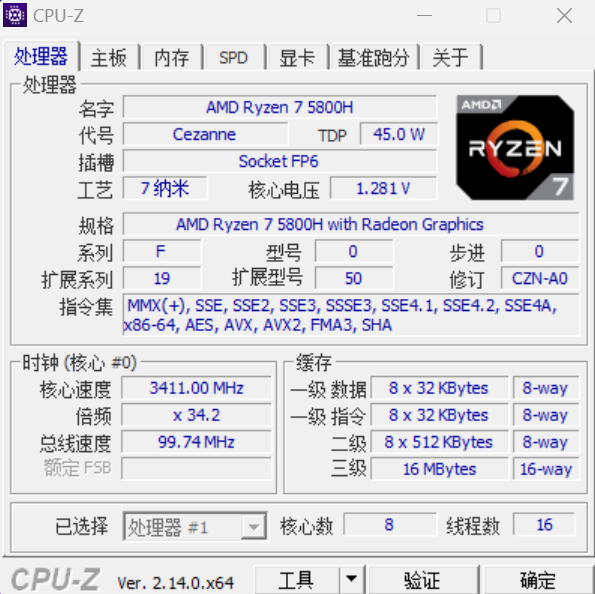
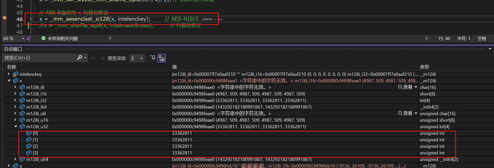
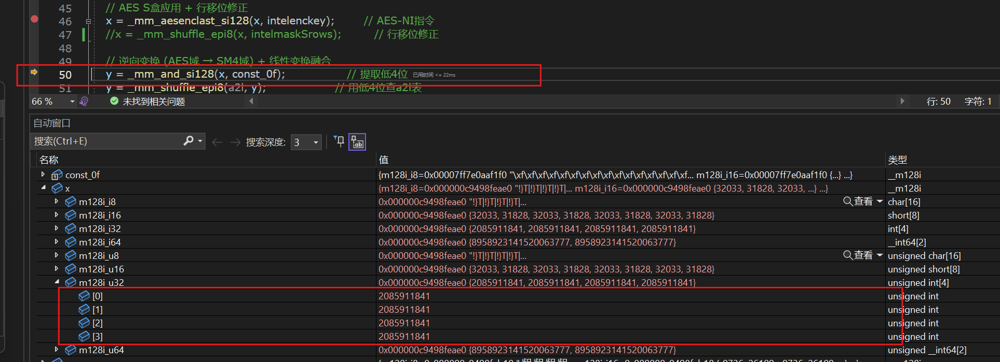

# SM4-AESNI指令优化实现原理讲解

## 前言

这几天一直在网上查找这个SM4-AESNI指令的优化方式，但是大多数资料都是语焉不详，本篇是我通过查找各种源码以及讲解反推出来的，实现上基于intel的实现思路，个人认为能从工程实现上较好地解释AESNI指令的优化方式。

如果本篇能帮到你，不妨给个star，万分感谢。

## 快速上手

## 优化思路

### 前置工作

首先要了解一下SM4的基础实现方式。这里不再赘述，SM4的基础讲解和实现方式在网上有很多，这里可以贴几个参考：[SM4算法详解：分组加密与密钥扩展-CSDN博客](https://blog.csdn.net/qq_41610725/article/details/116795599?ops_request_misc=%257B%2522request%255Fid%2522%253A%25222d083d63764d3e431b58e3ff951a44a3%2522%252C%2522scm%2522%253A%252220140713.130102334..%2522%257D&request_id=2d083d63764d3e431b58e3ff951a44a3&biz_id=0&utm_medium=distribute.pc_search_result.none-task-blog-2~all~top_positive~default-1-116795599-null-null.142^v102^pc_search_result_base8&utm_term=SM4&spm=1018.2226.3001.4187)。

其次要了解一下宏观上使用AES-NI指令优化思路。这个网上也有，可以贴一个参考：[图解Intel SM4-AES-NI实现方案-CSDN博客](https://blog.csdn.net/samsho2/article/details/127841308)

另外，我们需要了解一下 `<immintrin.h>`以及SIMD指令。现代的处理器上为了性能提升，很多都已经集成了AES等一些常用操作的指令，为了程序员使用方便，intel将这些指令封装成C函数，程序员可以通过调用头文件 `<immintrin.h>`来使用这些指令。你可以查看一下 `<immintrin.h>`头文件的介绍以及intel官方的手册了解一下。`<immintrin.h>`头文件的介绍网上也有挺多的；官方手册参考：[Intel® Intrinsics Guide](https://www.intel.com/content/www/us/en/docs/intrinsics-guide/index.html#ig_expand=6414,6003,5737,5782,6414,239,4106,6170,6546&text=_mm_storeu_si128)。同时你可以在这个手册中查找到我们要使用的AES指令：`_mm_aesenclast_si128`。该指令实现了AES加密操作的最后一轮，即：行位移，字节替换，轮密钥加。我们使用这个指令的目的就是让查找AES的S盒操作代替我们查找SM4的S盒操作，由于前者是指令实现的，所以肯定比后者定义变量然后内存取值更快。（PS：关于 `_mm_aesenclast_si128`具体有没有行移位操作存疑，在我实现的过程中我发现它并没有做行位移，但是网上的资料以及intel的官方文档中都说它有这一步操作，这一点我们也会在后续详细提到。）;SIMD是单指令集流多数据流，AES指令就是使用这个技术在两个128位的SIMD寄存器上实现x4并行的，它的资料网上也有很多，可以参考：[ SIMD简介 - 知乎 (zhihu.com)](https://zhuanlan.zhihu.com/p/55327037)。

最后，由于这些指令都是基于CPU架构的，所以有些计算机可能没有一些指令，你可以通过下载一个软件来验证：[CPU-Z | Softwares | CPUID](https://www.cpuid.com/softwares/cpu-z.html)。这个软件下载下来之后能很详细地查看你处理器的各项信息，其中包括支持的指令集架构（这些指令集架构大类也可以在[Intel® Intrinsics Guide](https://www.intel.com/content/www/us/en/docs/intrinsics-guide/index.html#ig_expand=6414,6003,5737,5782,6414,239,4106,6170,6546&text=_mm_storeu_si128)中看到）。比如我的电脑是这样的：



### 详细思路讲解

我们可以将优化的过程总结为一个公式:

```c
SM4-Sbox(x)=A2(AES-Sbox(A1(x)))
A1=M1*x+C1
A2=M2*x+C2
```

其中 `A1`、`A2`都是有限域映射，他们并不是唯一的，具体怎么构造的这些映射我已经没时间搞清楚了，感兴趣的读者可以再去复习一下有限域的相关理论基础。现在我直接把结论贴出来，intel使用的这个映射的参数是：

```c
uint8_t M1[] = { 0x52 ,0xbc ,0x2d ,0x02 ,0x9e ,0x25 ,0xac ,0x34 };
uint8_t C1 = 0x65;
uint8_t M2[] = { 0xcb ,0x9a ,0x0a ,0xb4 ,0xc7 ,0xac ,0x87 ,0x4e };
uint8_t C2 = 0x2f;
```

也就是说，我们想让一个值 `x`过SM4的S盒子，等价于经过A1映射，然后过AES的S盒，最后过A2映射映射回到SM4的有限域。这里举一个例子：比如我们想要查找 `x=0x00`的SM4-S盒的输出值，那么我们可以经过以下步骤：

```c
x=0x00;
A1(x)=M1*x+C1=0x65
AES-S盒中0X65 -> 0x4d
A2(0x4d)=M2*x+C2=0xd6 
而这个0xd6 即为SM4-S盒中 0x00 对应的值，（读者可以去查一下SM4和AES的S盒验证一遍。
```

另外请注意：这里的矩阵计算是在有限域上的计算，矩阵乘法是二进制矩阵乘法（模2加法，即异或运算），而向量加法也是模2（异或）。这里可以贴出一个我实现的计算代码：

```c
#include<stdio.h>
#include<stdint.h>
uint8_t M1[] = { 0x52 ,0xbc ,0x2d ,0x02 ,0x9e ,0x25 ,0xac ,0x34 };
uint8_t C1 = 0x65;
uint8_t M2[] = { 0xcb ,0x9a ,0x0a ,0xb4 ,0xc7 ,0xac ,0x87 ,0x4e };
uint8_t C2 = 0x2f;

uint8_t count_bits_4(uint32_t value)
{
    value = (value & 0x55555555) + ((value >> 1) & 0x55555555);
    value = (value & 0x33333333) + ((value >> 2) & 0x33333333);
    value = (value & 0x0f0f0f0f) + ((value >> 4) & 0x0f0f0f0f);
    value = (value & 0x00ff00ff) + ((value >> 8) & 0x00ff00ff);
    value = (value & 0x0000ffff) + ((value >> 16) & 0x0000ffff);

    return value;
}

uint8_t mult_A1(uint8_t x)
{
    uint8_t tmp = 0;
    for (int i = 0; i < 8; i++)
    {
        tmp |= ((count_bits_4(M1[i] & x) % 2) << (7 - i));
    }
    return tmp ^ C1;
}

uint8_t mult_A2(uint8_t x)
{
    uint8_t tmp = 0;
    for (int i = 0; i < 8; i++)
    {
        tmp |= ((count_bits_4(M2[i] & x) % 2) << (7 - i));
    }
    return tmp ^ C2;
}

int main()
{
     uint8_t y = mult_A1(0X00);
     printf("%x", y);

     uint8_t y1 = mult_A2(0x4d);
     printf("%x", y1);

}
```

#### important!

目前我们已经知道了如何从SM4映射到AES，以及如何映射回来，但是这并不能解决我们的问题，因为矩阵乘法是非常耗时的，所以在实现过程中引入上述映射转化计算来代替SM4的S盒只会徒增时间开销，达不到优化的目的。但是intel的工程师很聪明，他们想了一个预计算的优化方式，使得实际使用中相当于查找两个128bit大小的表。他们的优化思路如下：

```c
//我们知道：
A1(x)=M1*x+C1;
//其中x为8bit，那么我们可以有：
x=(x_high<<4)+(x_low); //其中x_high 是x的高4位比特，x_low是x的低四位比特。将该式子带入上面的公式：
A1(x)=M1*((x_high<<4)+(x_low))+C1=M1*(x_high<<4)+M1*(x_low)+C1
//我们重新划分一下式子，令：
A1_h(x_high)=M1*(x_high<<4) 	(1)
A1_l(x_low)=M1*(x_low)+C1	(2)
//那么原式子就是：
A1(x)=A1_h(x_high)+A1_l(x_low)
//如此我们便可以计算T1和T2两个表，怎么计算？很简单，就是遍历x=0~15带入(1) (2)式即可。
//由于x_high和x_low都是4比特大小的，所以A1_h和A1_l两个表都是8x16bit=128bit大小的(每个元素8bit，一共16项)
//这是一个很小的表，同时也可以正好塞进SIMD的128位的寄存器中

//同理，我们也可以对A2进行相同的操作，即：
A2(x)=A2_h(x_high)+A2_l(x_low)
A2_h(x_high)=M2*(x_high<<4)
A2_l(x_low)=M2*(x_low)+C2

//另外，C1和C2并不一定非得跟A1_l/A2_l放在一块儿，它也可以和A1_h、A2_h放在一块，甚至你把它拆成高低四位分别给A1_h、A1_l\A2_h、A2_l也行。只要最终满足等式：
//A1_h(x_high)=M1*(x_high<<4)  、A2(x)=A2_h(x_high)+A2_l(x_low)就行。在本文中我们就按照将C1/C2融合到低位计算中的方法进行。
```

下面给出计算这四个表的代码，（其中需要包含刚才给出的计算有限域乘法和加法的函数）：

```c
#include<stdio.h>
#include<stdint.h>

uint8_t M1[] = { 0x52 ,0xbc ,0x2d ,0x02 ,0x9e ,0x25 ,0xac ,0x34 };
uint8_t C1 = 0x65;
uint8_t M2[] = { 0xcb ,0x9a ,0x0a ,0xb4 ,0xc7 ,0xac ,0x87 ,0x4e };
uint8_t C2 = 0x2f;

void cal_A12(int a)
{
    uint8_t a1l[16];
    uint8_t a1h[16];
    if (a == 0)
    {
        for (int i = 0; i < 16; i++)
        {
            a1l[i] = mult_A1((uint8_t)i);
            a1h[i] = mult_A1((uint8_t)(i << 4)) ^ C1;
        }

        printf("uint8_t a1l[16]={");
        for (int i = 0; i < 16; i++)
        {
            printf("0x%x, ", a1l[i]);
        }
        printf("};\n");
        printf("uint8_t a1h[16]={");
        for (int i = 0; i < 16; i++)
        {
            printf("0x%x, ", a1h[i]);
        }
        printf("};\n");

    }
    else if (a == 1)
    {
        for (int i = 0; i < 16; i++)
        {
            a1l[i] = mult_A2(((uint8_t)i) );
            a1h[i] = mult_A2((((uint8_t)i) ) << 4) ^ C2;
        }
        printf("uint8_t a2l[16]={");
        for (int i = 0; i < 16; i++)
        {
            printf("0x%x, ", a1l[i]);
        }
        printf("};\n");
        printf("uint8_t a2h[16]={");
        for (int i = 0; i < 16; i++)
        {
            printf("0x%x, ", a1h[i]);
        }
        printf("};\n");
    }
}

int main()
{
   cal_A12(0);
    cal_A12(1);
}
```

上述代码最后应该会输出如下内容：

```c
uint8_t a1l[16]={0x65, 0x41, 0xfd, 0xd9, 0xa, 0x2e, 0x92, 0xb6, 0xf, 0x2b, 0x97, 0xb3, 0x60, 0x44, 0xf8, 0xdc, };
uint8_t a1h[16]={0x0, 0xc9, 0x67, 0xae, 0x80, 0x49, 0xe7, 0x2e, 0x4a, 0x83, 0x2d, 0xe4, 0xca, 0x3, 0xad, 0x64, };
uint8_t a2l[16]={0x2f, 0xa5, 0xc4, 0x4e, 0x30, 0xba, 0xdb, 0x51, 0xca, 0x40, 0x21, 0xab, 0xd5, 0x5f, 0x3e, 0xb4, };
uint8_t a2h[16]={0x0, 0x50, 0x14, 0x44, 0x89, 0xd9, 0x9d, 0xcd, 0xde, 0x8e, 0xca, 0x9a, 0x57, 0x7, 0x43, 0x13, };
```

这四个就是我们计算出来的表。

#### SM4_box_aesenclast优化代码实现

这一部分的代码实现的是SM4的S盒优化。代码写在了当前目录下的 `./sm4_box_aesenclast_intel.c`中，也是优化最核心的地方。

```c
__m128i sm4_box_aesenclast_intel(uint32_t rk,   __m128i t0, __m128i t1, __m128i t2, __m128i t3)
```

这个函数是最关键的实现函数，它接受一个32bit的轮密钥以及四个128bit的输入分组：`t0,t1,t2,t3`。注意，这里的输入分组并不是单纯的连续的明文密文，他需要先对4个128bit的明密文块进行分组合并。具体过程如下：

```c
//假设我们现在有四个长度为128bit的明文块，每个元素都是32bit
unint_32 A[]={a0,a1,a2,a3};
unint_32 B[]={b0,b1,b2,b3};
unint_32 C[]={c0,c1,c2,c3};
unint_32 D[]={d0,d1,d2,d3};
那么重组之后的t0123为：
t0={a0,b0,c0,d0};
t1={a1,b1,c1,d1};
t2={a2,b2,c2,d2};
t3={a3,b3,c3,d3};
```

为什么要这样重组呢？这样重组的目的是实现并行处理四块明文/密文。在函数的代码中第一步实际操作就是：

```c
// 状态组合: x = t1 ^ t2 ^ t3 ^ rk
    __m128i x = _mm_xor_si128(t1, t2);
    x = _mm_xor_si128(x, t3);
    x = _mm_xor_si128(x, rk128);
```

如此一来:

```c
x={a1^a2^a3^rk,b1^b2^b3^rk,c1^c2^c3^rk,d1^d2^d3^rk}
```

这与我们在SM4中的操作一致。之后，我们取x的高四位和低四位分别去a1_low和a1_high表中取值并执行异或操作，从而实现从SM4到AES的有限域的转变：

```c
// 前向变换 (SM4域 → AES域)
    __m128i y = _mm_and_si128(x, const_0f);          // 提取低4位
    y = _mm_shuffle_epi8(a1_low, y);                   // 用低4位查a1l表
    x = _mm_srli_epi64(x, 4);                       // 右移4位
    x = _mm_and_si128(x, const_0f);                 // 提取高4位
    x = _mm_xor_si128(_mm_shuffle_epi8(a1_high, x), y); // 查a1h表并异或
```

上述代码执行完成后，x中存储的即为AES中需要进行查表的一个值，因此我们执行 `_mm_aesenclast_si128`指令：

```c
 // AES S盒应用 + 行移位修正
    x = _mm_aesenclast_si128(x, intelenckey);        // AES-NI指令
    //x = _mm_shuffle_epi8(x, intelmaskSrows);         // 行移位修正
```

首先，在执行该指令的时候，我们给AES传入的轮密钥 `intelenckey`是一个全0的数，从而消除轮密钥加的作用。另外，你也可以注意到我把行位移修正的代码去掉了，这是因为我在调试过程中发现这条aes指令并没有执行实际的行位移操作，读者可以看我的调试图：



在没有执行这一步的时候，可以看到x中的4个32bit的数都是相同的，即 `33362811`，十六进制为 `0x1fd137b`：。当我们按下F11后：



x的四个32位的数字还是都相同，这里的 `2085911841`，十六进制对应为：`0x7c547d21`。正是对应于 `0x1fd137b`按照每字节查找AES-S盒所得到的值，如果它产生了行位移，这四个32位的数字应该会因为移位操作而不同，比如会变成：`0x7c547d21	0x217c547d	0x7d217c54	0x547d217c` 。这也是我疑惑的一个点，因为连intel的官方手册中都明确写了它实现了行位移，但事实就是它没有。(小猫摊手~)

之后就是对执行完AES指令后的值过A2变换，将其重新对应到SM4的作用域中去：

```c
// 逆向变换 (AES域 → SM4域) + 线性变换融合
    y = _mm_and_si128(x, const_0f);                 // 提取低4位
    y = _mm_shuffle_epi8(a2_low, y);                   // 用低4位查a2l表
    x = _mm_srli_epi64(x, 4);                       // 右移4位
    x = _mm_and_si128(x, const_0f);                 // 提取高4位
    x = _mm_xor_si128(_mm_shuffle_epi8(a2_high, x), y); // 查a2h表并异或
```

最终的值就是经过SM4的S盒的值。之后还需要进行循环左移异或以及异或上X0的操作。

补充解释一下查表操作，我们的代码中的查表操作执行了一个指令：`_mm_shuffle_epi8(a,b)`，读者可以去intel的官方文档中去查一下这条指令的伪代码，这条指令的作用从直观解释上就是将128bit的a以字节为单位，按照128bit的参数b中的以字节为单位的索引值重新映射一下。如:

```c
_m128i a=0x0123456789abcedf0123456789abcedf;
_m128i b=0x0f0e0d0c0b0a09080706050403020100;
则：
x=_mm_shuffle_epi8(a,b);
x=dfceab8967452301dfceab8967452301;//全逆序排列
```

这只是一个直观的理解，对于该指令更精确的描述请看intel官方文档。

#### sm4_aesin_x4

这部分的代码实现的是sm4加密四个128bit的数据块的操作。刚才的优化只是实现了SM4的S盒操作，其实除了4块并行操作，其他的操作和基础的SM4操作并没有太大的区别，但是还是有几点在实现的时候需要注意一下。

代码的核心是这个：

```c
static void SM4_AESNI_do(uint8_t* in, uint8_t* out, SM4_Key* sm4_key, int enc)
```

##### 大小端问题

这是在实现这个函数中最需要重点强调的一个坑。假设:

```c
uint8_t in[]={	0x01,0x12,0x34,0x45,067,0x89,0xab,0xcd,0xef,0xfe,0xdc,0xba,0x98,0x76,0x54,0x32,0x10,
		0x01,0x12,0x34,0x45,067,0x89,0xab,0xcd,0xef,0xfe,0xdc,0xba,0x98,0x76,0x54,0x32,0x10
		0x01,0x12,0x34,0x45,067,0x89,0xab,0xcd,0xef,0xfe,0xdc,0xba,0x98,0x76,0x54,0x32,0x10
		0x01,0x12,0x34,0x45,067,0x89,0xab,0xcd,0xef,0xfe,0xdc,0xba,0x98,0x76,0x54,0x32,0x10};
uint32_t rk=0xf12186f9;		//第一轮的轮密钥
```

按照正常的大端思路，我们的实现会是：

```c
t0={0x01234567,0x01234567,0x01234567,0x01234567};
t1={0x89abcdef,0x89abcdef,0x89abcdef,0x89abcdef};
t2={0xfedcba98,0xfedcba98,0xfedcba98,0xfedcba98};
t3={0x76543210,0x76543210,0x76543210,0x76543210};

rk={0xf12186f9,0xf12186f9,0xf12186f9,0xf12186f9};

//则t1^t2^t3^rk=0x89abcdef^0xfedcba98^0x76543210^0xF12186F9=0xf002c39e
x={0xf002c39e,0xf002c39e,0xf002c39e,0xf002c39e};
```

非常漂亮。但是在实际实现中，x86架构是小端序的，如果我们以uint8_t类型声明了一个变量：

```c
uint8_t in[]={	0x01,0x12,0x34,0x45,067,0x89,0xab,0xcd,0xef,0xfe,0xdc,0xba,0x98,0x76,0x54,0x32,0x10, 
		0x01,0x12,0x34,0x45,067,0x89,0xab,0xcd,0xef,0xfe,0xdc,0xba,0x98,0x76,0x54,0x32,0x10 
		0x01,0x12,0x34,0x45,067,0x89,0xab,0xcd,0xef,0xfe,0xdc,0xba,0x98,0x76,0x54,0x32,0x10 
		0x01,0x12,0x34,0x45,067,0x89,0xab,0xcd,0xef,0xfe,0xdc,0xba,0x98,0x76,0x54,0x32,0x10};
```

那么t1在内存中的布局为：

```c
低地址	0x89abcdef,0x89abcdef,0x89abcdef,0x89abcdef	高地址
```

当变量in作为一个_m128i类型的指针传递给指令 `_mm_loadu_si128`中时，in所指向的值会按照在内存中的顺序被装载到m128i寄存器中，这个大端序的数据块会以小端序的方式解释，导致系统看到的t0是一个如下的数字：

```c
高位	0xefcdab89,0xefcdab89,0xefcdab89,0xefcdab89	低位
```

但是系统应该看到：

```c
高位	0x89abcdef,0x89abcdef,0x89abcdef,0x89abcdef	低位
```

总结来说就是，按照上述方式传递一个uint_8指针的方式，会导致程序将一个大端序的数据误认为是一个小端序的。因此在加载数据块的时候，除了需要对数据块进行一次分块打包外，还需要做一个大小端的调换操作（在./sm4_aesin_x4.c中的第48行）：

```c
// // Shuffle Endian
    X[0]=sm4_to_big_endian(X[0]);
    X[1]=sm4_to_big_endian(X[1]);
    X[2]=sm4_to_big_endian(X[2]);
    X[3]=sm4_to_big_endian(X[3]);
```

然后在完成所有加密操作的时候重新调用上述四行把大小端调换回去。

这个大小端调换的操作是必需的，因为如果不进行这个操作，那么我们SM4操作相当于在正常加解密前添加了一步将32位的明文逆序。虽然密文仍然能解密出对应的明文，但是这会导致我们的算法和国密标准文档中的示例不一致，是实现上的错误。

另外，这个大小端调换的函数是一个内联函数，定义在了 `sm4_aesin_x4.h`中。

## 参考代码以及资料

[AES加密算法原理的详细介绍与实现-CSDN博客](https://blog.csdn.net/qq_28205153/article/details/55798628)

[SM4 AESNI指令集优化(intel) - kentle - 博客园 (cnblogs.com)](https://www.cnblogs.com/kentle/p/15826075.html) （Ps：这位佬使用矩阵乘法做的SM4和AES之间的映射，所以他的代码会比基础的SM4算法实现慢几十倍，但是他仍然给我提供了很多思路和参考资料，respect。）

[SM4 with AESENCLAST · emmansun/gmsm Wiki (github.com)](https://github.com/emmansun/gmsm/wiki/SM4-with-AESENCLAST)
