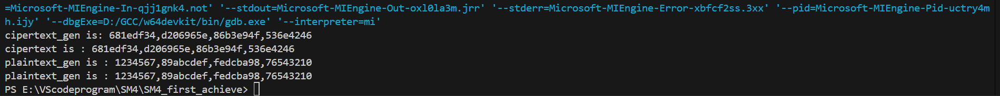

# MS4 算法基础实现

## 快速运行

我的开发平台是vscode，因此该项目中会有一个 `.vscode`文件夹，内部放置了 `launch.json,tasks.json`两个文件，分别是程序调试启动配置，和程序编译配置。可以使用vscode直接编译并运行。

如果不采用vscode，也可以使用命令行运行，请在该文件夹路径下输入命令：

```
./MS4_basic.exe -E ./sample.txt ./key.txt ./encsample.txt 	//加密
./MS4_basic.exe -D ./encsample.txt ./key.txt ./vertify.txt 	//解密
```

这两条命令第一条会读取 `./key.txt`中存储的密钥，将 `./sample.txt`明文文件加密到 密文文件 `./encsample.txt`中。同理，第二条命令会解密 `./encsample.txt`并将结果放到文件 `./vertify.txt`中。你可以运行完这两条命令并观察 `./vertify.txt `和 `./sample.txt` 文件的内容验证算法的正确性。

由于实现主要考虑算法，而不是实际使用，所以没有做太多适配指令。只做了ECB模式，并只有上述两种格式的加解密指令。

另外算法的正确性也是经过验证了的。通过观察十六进制文件，我的算法和SM4国密标准文档中提供的示例明文密文和轮密钥都是可以匹配上的，这里插入一个调试截图：



相关的调试代码也在main.c中有留存，被注释的部分：

```c
// //test example
// int main()
// {
  
//     word4 plaintext={0x01234567,0x89ABCDEF,0xFEDCBA98,0X76543210};
//     word4 plaintext_gen={0};
//     word4 key={0x01234567,0x89ABCDEF,0xFEDCBA98,0X76543210};
//     word4 cipertext={0X681EDF34,0XD206965E,0X86B3E94F,0X536E4246};
//     word4 cipertext_gen={0};
//     encrypt_block(plaintext,key,cipertext_gen);
//     printf("cipertext_gen is: %llx,%llx,%llx,%llx \n",cipertext_gen[0],cipertext_gen[1],cipertext_gen[2],cipertext_gen[3]);
//     printf("cipertext is : %llx,%llx,%llx,%llx \n",cipertext[0],cipertext[1],cipertext[2],cipertext[3]);
//     for(int i=0;i<4;i++)
//     {
//         if (cipertext[i]!=cipertext_gen[i])
//         {
//             printf("encrypt fail\n");
//             break;
//         }
//     }

//     decrypt_block(cipertext,key,plaintext_gen);
//     printf("plaintext_gen is : %llx,%llx,%llx,%llx \n",plaintext_gen[0],plaintext_gen[1],plaintext_gen[2],plaintext_gen[3]);
//     printf("plaintext_gen is : %llx,%llx,%llx,%llx \n",plaintext[0],plaintext[1],plaintext[2],plaintext[3]);
//     for(int i=0;i<4;i++)
//     {
//         if (plaintext_gen[i]!=plaintext[i])
//         {
//             printf("decrypt fail\n");
//             break;
//         }
//     }


//     // //test key_gen
//     // word4 key={0x01234567,0x89ABCDEF,0xFEDCBA98,0X76543210};
//     // word32 roundkey={0};
//     // key_gen(key,&roundkey);
//}
```

## 算法实现细节及代码说明

在文件basic_type.c中定义了一些SM4使用的常量。

在文件basic_type.h中定义了一些算法实现的一些类型。

在文件func_T.h中定义了T函数的实现，包括生成轮密钥的T函数 `func_T_extend_key(wordk)`和加解密中的T函数 `func_T_encrypt`.

在文件MS4.c中定义了基础的加解密一个块的函数 `encrypt_block`和 `decrypy_block`，以及生成轮密钥的函数 `key_gen`.之后定义的两个大函数 `SM4_enc_file`和 `SM4_dec_file`是对 `encrypt_block`和 `decrypy_block`和 `key_gen`的封装，实现了整个加解密过程。

在文件main.c中写了函数入口，并对命令参数做了一些检查。

---

Ps:整个代码架构或许会有些臃肿，很多没必要的代码定义（比如类型定义）以及代码分文件。这是因为写这个SM4算法的时候我顺道把C语言重新复习了一遍，弄懂了大一学C的时候没能弄懂的问题，同时也尽量尝试了一些之前没有学到的/学的不深入的东西。所以就有了现在稍显臃肿的代码。

## 参考以及一些前置知识

[1][国家标准|GB/T 32907-2016 (samr.gov.cn)](https://openstd.samr.gov.cn/bzgk/gb/newGbInfo?hcno=7803DE42D3BC5E80B0C3E5D8E873D56A&refer=outter)

[2][SM4算法详解（2021-12-8）-CSDN博客](https://blog.csdn.net/qq_40662424/article/details/121791745)

[3] [VScode 调试教程 tasks.json和launch.json的设置（超详细）_vscode launch.json在哪-CSDN博客](https://blog.csdn.net/weixin_55334020/article/details/134442270)

[4][C 语言教程 | 菜鸟教程 (runoob.com)](https://www.runoob.com/cprogramming/c-tutorial.html)
